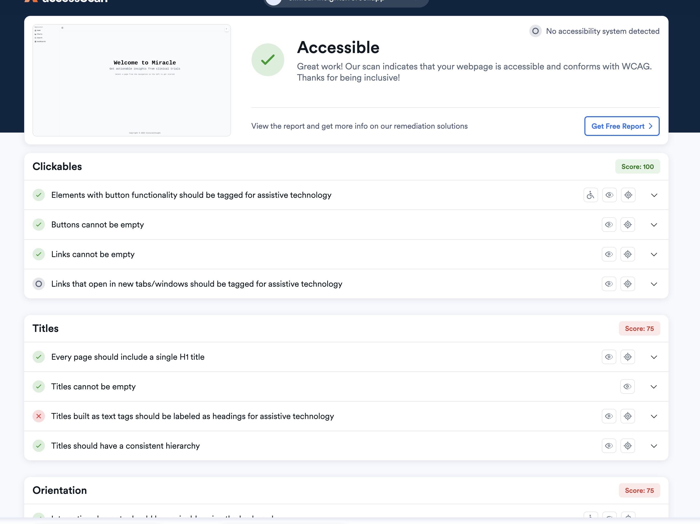

# ClinicalInsight

Try [here](https://clinical-insights.vercel.app/)

This is my submission for the [Miracle](https://www.miracleml.com/) takehome challenge.

## Getting Started

The following directions use [Bun](https://www.bun.sh), but `npm` and `yarn` should work fine.

Install dependencies

```
bun i
```

Running the web app

```
bun run dev
```

## Technologies Used

- React / Typescript
- Vite (build tool)
- Bun (a superior JS runtime and package manager)
- Tailwind CSS + [Shadcn](https://ui.shadcn.com/)
- Vercel (hosting/deployment)

Why Tailwind and Shadcn? Tailwind is a popular CSS framework which I've used before, but it does not provide components (e.g., drop-downs, forms). However, I don't love most component libraries (e.g., MaterialUI), as they are hard to customize. In contrast, Shadcn is a much more customizable component library which uses Tailwind and RadixUI.

## AI-assistance

- IDE: Cursor (with occassional experimentation with Claude Code)
- Models: Claude Sonnet + Opus

I didn't "vibe-code" this assignment. While vibe-coding is great for quickly creating MVPs, I wanted to be able to justify the technical choices made in this project. Additionally, while I could have pasted the technical spec into an app creator like Loveable, I wanted much more control over the product design of this application.

However, I did use AI in the following ways:

1. Brainstorm approaches to problems (e.g., how to implement font resizing)
2. Debugging well-defined issues (e.g., "why is this component not centered?")
3. Refactoring code and components (e.g., "split this large component into 5 different ones" )
4. Drafting the first approach for UI components (e.g., the 'add chart' feature)

## Accessibilty

I confirmed the accessiblity of this app using [Accessibe](https://accessibe.com/accessscan).



## Extensions

Possible improvements:

1. Integrate more clinical trial data through a backend (e.g, database to store the parsed trial data, or fetch this using APIs )

2. Allow users to generate their own charts

3. User authentication to track layouts and other configurations
